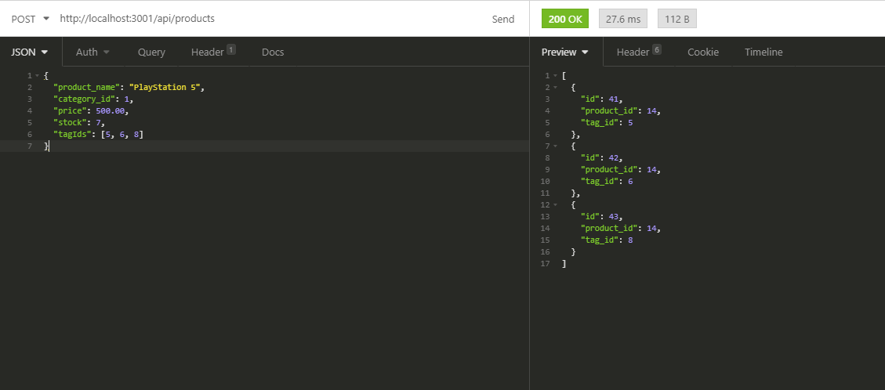

# E-Commerce Back-End

## Description

This server was made to store and keep track of the inventory of a store. You can create, update and delete products and also associate them with certain tags and categories. When you hit an endpoint to retrieve all the items, you'll be able to see the associated categories and tags a product has. The server was set up with Express.js and uses Sequelize to convert JavaScript to SQL in order to communicate with the database.

## Table of Contents

* [Usage](#usage)
* [License](#license)
* [Questions](#questions)
    
## Usage

### Link to Walkthrough Video:
https://drive.google.com/file/d/1dntps7mM2Zd5CCEfMsT4RKpF6x9VJVgL/view

During the walkthrough there is an error that occured when adding a product to the database in Insomnia but the reason it occured was because there was no category id and because in the request a deleted product tag tried to be assigned to the new product but it successfully works as shown in the screenshot below
    
[]

## License

Licensed under the [MIT License](LICENSE.txt).

## Questions

My [GitHub](https://github.com/junioresc/)  
If you have any additional questions and would like to reach me, you can at junioresc1092@gmail.com